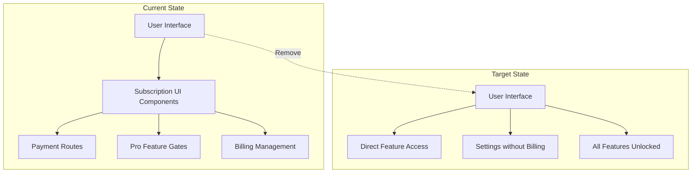
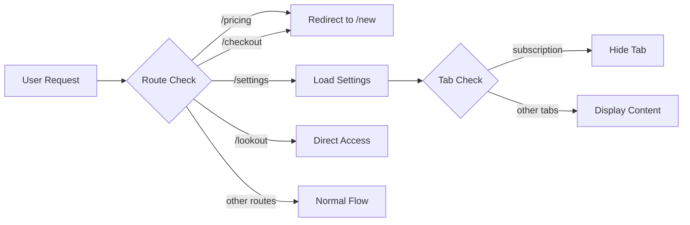
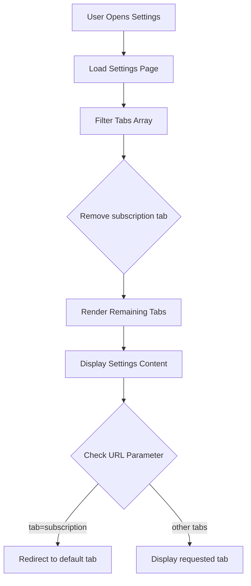
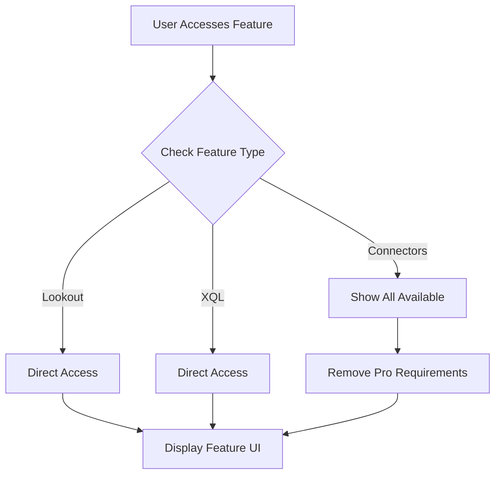
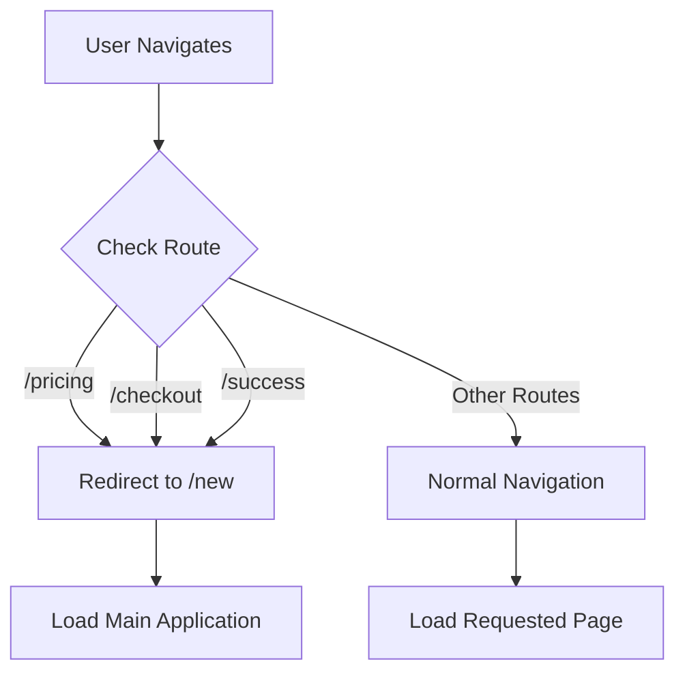

# Design Document

## Overview

This design document outlines the technical implementation for removing all subscription, Pro membership, and payment-related UI elements from the self-hosted Scira instance. The implementation will focus on UI modifications while preserving all existing functionality, as the backend already treats all features as unlimited.

## Architecture Design

### System Architecture Diagram



### Data Flow Diagram



## Component Design

### Component A: Settings Page Modification
- **Responsibilities:** Display user settings without subscription tab
- **Interfaces:** Remove subscription tab from navigation, remove SubscriptionSection import
- **Dependencies:** settings-dialog components (modified versions)
- **Files:** `app/settings/page.tsx`, `components/settings-dialog.tsx`

### Component B: Route Handlers
- **Responsibilities:** Redirect payment-related routes to main application
- **Interfaces:** Middleware or route configuration to handle redirects
- **Dependencies:** Next.js routing system
- **Files:** Create `middleware.ts` or modify route handlers

### Component C: Feature Access Components
- **Responsibilities:** Provide direct access to all features without upgrade prompts
- **Interfaces:** Remove Pro upgrade screens, modify feature entry points
- **Dependencies:** Feature components
- **Files:** `app/lookout/page.tsx`, `components/xql-pro-upgrade-screen.tsx`

### Component D: Navigation Cleanup
- **Responsibilities:** Remove all pricing and payment links from navigation
- **Interfaces:** Modified navigation components
- **Dependencies:** UI components
- **Files:** `app/about/page.tsx`, various navigation components

## Data Model

### Core Data Structure Definitions

```typescript
// Remove these interfaces/types from the codebase
interface SubscriptionData {
  hasSubscription: boolean;
  subscription?: any;
}

interface ProUpgradeProps {
  user: any;
  isProUser: boolean;
  isProStatusLoading: boolean;
}

// Keep but always return unlimited values
interface UserContext {
  isProUser: true; // Always true for self-hosted
  hasActiveSubscription: true; // Always true
  shouldCheckLimits: false; // Never check limits
}
```

## Business Process

### Process 1: Settings Page Load



### Process 2: Feature Access Flow



### Process 3: Route Redirect Flow



## Implementation Strategy

### Phase 1: Route Redirects
1. Create middleware to intercept and redirect payment routes
2. Remove pricing and checkout pages
3. Update success page redirect

### Phase 2: Settings Modification
1. Remove subscription tab from settings navigation
2. Remove SubscriptionSection component usage
3. Update ConnectorsSection to remove Pro gates

### Phase 3: Feature Access Updates
1. Remove ProUpgradeScreen from Lookout
2. Remove XQLProUpgradeScreen
3. Update feature entry points for direct access

### Phase 4: UI Cleanup
1. Remove Pro badges and Crown icons
2. Remove pricing links from navigation
3. Update about page to remove pricing section

### Phase 5: Component Cleanup
1. Remove unused subscription-related components
2. Update error messages to remove Pro references
3. Clean up unused imports

## Error Handling Strategy

### Missing Route Handling
- Routes like `/pricing` and `/checkout` will redirect to `/new`
- No 404 errors for payment routes - graceful redirects instead

### Component Dependencies
- Safely remove components by checking all imports first
- Use conditional rendering where complete removal isn't possible
- Maintain component interfaces to prevent breaking changes

### Feature Access
- All features default to unlimited access
- Remove error states related to subscription requirements
- Ensure feature functionality remains intact

## Testing Strategy

### Manual Testing Checklist
1. Verify settings page loads without subscription tab
2. Confirm /pricing and /checkout redirect to /new
3. Test all connectors are accessible without Pro prompts
4. Verify Lookout feature direct access
5. Check XQL feature direct access
6. Confirm no Pro badges appear in UI
7. Test navigation has no pricing links
8. Verify about page has no pricing section

### Automated Testing
1. Route redirect tests
2. Component render tests without subscription props
3. Feature access validation tests

## File Modification List

### Files to Modify
1. `app/settings/page.tsx` - Remove subscription tab
2. `components/settings-dialog.tsx` - Remove SubscriptionSection, update ConnectorsSection
3. `app/about/page.tsx` - Remove pricing section
4. `app/lookout/page.tsx` - Remove Pro upgrade check
5. `components/chat-interface.tsx` - Remove upgrade prompts
6. `components/message.tsx` - Remove Pro error displays
7. `components/user-profile.tsx` - Remove Pro badges
8. `app/(search)/c/[id]/page.tsx` - Remove Pro checks
9. `app/api/search/route.ts` - Ensure Pro checks remain disabled
10. `components/ui/form-component.tsx` - Remove upgrade dialogs

### Files to Delete
1. `app/pricing/` - Entire directory
2. `app/checkout/` - Entire directory
3. `app/lookout/components/pro-upgrade-screen.tsx`
4. `components/xql-pro-upgrade-screen.tsx`

### New Files to Create
1. `middleware.ts` - Handle route redirects

## Implementation Order

1. **Create middleware for route redirects** - Prevents access to payment pages
2. **Modify settings page** - Remove subscription tab and section
3. **Update feature access** - Remove upgrade screens
4. **Clean navigation** - Remove pricing links
5. **Remove Pro indicators** - Clean up UI elements
6. **Delete unused files** - Remove payment-related pages
7. **Test all changes** - Verify functionality

## Rollback Strategy

If issues arise during implementation:
1. Git revert specific commits
2. Test affected features
3. Re-implement with adjusted approach
4. Maintain feature functionality as top priority

## Security Considerations

- No security risks as we're removing payment features
- Ensure no payment processing code remains
- Verify no API keys or payment credentials are exposed
- Maintain user data privacy

## Performance Impact

- Positive impact: Fewer components to load
- Reduced bundle size by removing payment libraries
- Faster page loads without subscription checks
- Simplified rendering logic