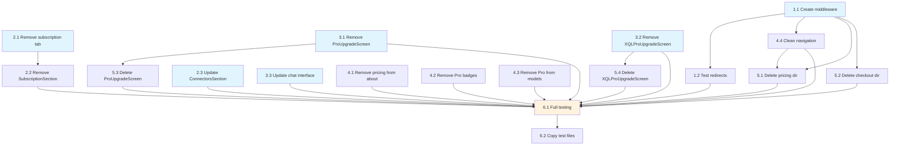

# Implementation Tasks

## Phase 1: Route Redirects and Middleware

- [x] 1.1 Create middleware for route redirects
  - Priority: High
  - Dependencies: None
  - Files: scira-repo/middleware.ts (new file)
  - Acceptance: Middleware intercepts /pricing, /checkout, /success routes and redirects to /new
  - Requirements: 3.1, 3.2, 3.5, 9.1

- [x] 1.2 Test route redirects
  - Priority: High
  - Dependencies: 1.1
  - Files: None (manual testing)
  - Acceptance: Accessing /pricing, /checkout, /success redirects to /new without errors
  - Requirements: 3.1, 3.2, 3.5

## Phase 2: Settings Page Modifications

- [x] 2.1 Remove subscription tab from settings navigation
  - Priority: High
  - Dependencies: None
  - Files: scira-repo/app/settings/page.tsx
  - Acceptance: Settings page displays without subscription tab in both desktop and mobile views, URL parameter ?tab=subscription redirects to default tab
  - Requirements: 1.1, 1.2, 1.3

- [x] 2.2 Remove SubscriptionSection component usage
  - Priority: High
  - Dependencies: 2.1
  - Files: scira-repo/app/settings/page.tsx, scira-repo/components/settings-dialog.tsx
  - Acceptance: SubscriptionSection component is not imported or rendered, no subscription-related content appears
  - Requirements: 1.1, 5.1, 5.2, 5.3, 5.4

- [x] 2.3 Update ConnectorsSection to remove Pro gates
  - Priority: High
  - Dependencies: None
  - Files: scira-repo/components/settings-dialog.tsx
  - Acceptance: ConnectorsSection shows all connectors as accessible, no "Upgrade to Pro" prompts, beta announcement does not mention Pro requirements
  - Requirements: 2.1, 2.2, 2.3, 2.4

## Phase 3: Feature Access Updates

- [x] 3.1 Remove ProUpgradeScreen from Lookout feature
  - Priority: High
  - Dependencies: None
  - Files: scira-repo/app/lookout/page.tsx
  - Acceptance: Lookout page provides direct access without showing ProUpgradeScreen component
  - Requirements: 4.1, 4.3, 4.4

- [x] 3.2 Remove XQLProUpgradeScreen component
  - Priority: High
  - Dependencies: None
  - Files: scira-repo/app/xql/page.tsx (if exists), or related XQL entry points
  - Acceptance: XQL feature accessible without upgrade screen
  - Requirements: 4.2, 4.3, 4.4

- [x] 3.3 Update chat interface to remove upgrade prompts
  - Priority: High
  - Dependencies: None
  - Files: scira-repo/components/chat-interface.tsx
  - Acceptance: Chat interface does not show Pro upgrade buttons or Crown icons for model limits
  - Requirements: 4.3, 6.1, 6.2, 6.3

## Phase 4: UI Cleanup and Navigation

- [x] 4.1 Remove pricing section from about page
  - Priority: Medium
  - Dependencies: None
  - Files: scira-repo/app/about/page.tsx
  - Acceptance: About page does not display pricing section, student discount section, or upgrade buttons
  - Requirements: 3.3, 7.1, 7.3, 10.1, 10.2, 10.3

- [x] 4.2 Remove Pro badges and Crown icons from user profiles
  - Priority: Medium
  - Dependencies: None
  - Files: scira-repo/components/user-profile.tsx, scira-repo/app/settings/page.tsx
  - Acceptance: User profile displays without Pro badges, subscription status indicators removed
  - Requirements: 1.4, 7.2

- [x] 4.3 Remove Pro indicators from model selector and error messages
  - Priority: Medium
  - Dependencies: None
  - Files: scira-repo/components/message.tsx, scira-repo/components/ui/form-component.tsx
  - Acceptance: Model selector shows no Pro badges, error messages do not mention Pro subscriptions
  - Requirements: 6.1, 6.2, 6.4, 7.2

- [x] 4.4 Clean up navigation links to pricing
  - Priority: Medium
  - Dependencies: 1.1
  - Files: scira-repo/app/about/page.tsx, any navigation components
  - Acceptance: No navigation links point to /pricing or /checkout
  - Requirements: 3.4, 7.1

## Phase 5: Component Cleanup and File Deletion

- [x] 5.1 Delete pricing page directory
  - Priority: Low
  - Dependencies: 1.1, 4.4
  - Files: scira-repo/app/pricing/ (entire directory)
  - Acceptance: Pricing directory deleted, no broken imports or references
  - Requirements: 3.1

- [x] 5.2 Delete checkout page directory
  - Priority: Low
  - Dependencies: 1.1
  - Files: scira-repo/app/checkout/ (entire directory)
  - Acceptance: Checkout directory deleted, no broken imports or references
  - Requirements: 3.2

- [x] 5.3 Delete ProUpgradeScreen component file
  - Priority: Low
  - Dependencies: 3.1
  - Files: scira-repo/app/lookout/components/pro-upgrade-screen.tsx
  - Acceptance: File deleted, no broken imports
  - Requirements: 4.1

- [x] 5.4 Delete XQLProUpgradeScreen component file
  - Priority: Low
  - Dependencies: 3.2
  - Files: scira-repo/components/xql-pro-upgrade-screen.tsx
  - Acceptance: File deleted, no broken imports
  - Requirements: 4.2

## Phase 6: Final Testing and Validation

- [x] 6.1 Comprehensive functionality testing
  - Priority: High
  - Dependencies: All previous tasks
  - Files: None (manual testing)
  - Acceptance: All features work correctly - connectors, Lookout, XQL, chat interface, settings; no console errors; no Pro/subscription UI visible
  - Requirements: 8.1, 8.2, 8.3, 8.4

- [x] 6.2 Copy test files to ai_specs directory
  - Priority: Low
  - Dependencies: 6.1
  - Files: Any created test files should be copied to scira-repo/ai_specs/remove-subscription-ui/tests/
  - Acceptance: Test files copied to specs directory for review
  - Requirements: N/A (documentation requirement)

## Tasks Dependency Diagram

## Total Tasks: 16
Estimated Time: 4-6 hours
Success Metrics: All subscription/payment UI removed, all features remain fully functional, no console errors
<!-- ORCHESTRATOR-TASKS-SYNC START -->
## Orchestrator Task Status

- [x] **1.1** — Task 1.1
  - Status: completed
  - Atualizado: 2025-11-02T20:54:26.569809+00:00
  - Assistente: Codex (terminal 53753e25-6237-42a1-baa3-da94711e2a33) — comando: codex --dangerously-bypass-approvals-and-sandbox "Execute the entire Phase 1 (2 items): - [1.1] Task 1.1 - Auto-generate...
- [x] **1.2** — Task 1.2
  - Status: completed
  - Atualizado: 2025-11-02T20:54:28.108482+00:00
  - Assistente: Codex (terminal 53753e25-6237-42a1-baa3-da94711e2a33) — comando: codex --dangerously-bypass-approvals-and-sandbox "Execute the entire Phase 1 (2 items): - [1.1] Task 1.1 - Auto-generate...
- [x] **2.1** — Task 2.1
  - Status: completed
  - Atualizado: 2025-11-02T20:54:29.466619+00:00
  - Assistente: Codex — comando: cd /Users/guilhermevarela/Public/scira-repo && codex --dangerously-bypass-approvals-and-sandbox
- [x] **2.2** — Task 2.2
  - Status: completed
  - Atualizado: 2025-11-02T20:54:30.991552+00:00
  - Assistente: Codex — comando: cd /Users/guilhermevarela/Public/scira-repo && codex --dangerously-bypass-approvals-and-sandbox
- [x] **2.3** — Task 2.3
  - Status: completed
  - Atualizado: 2025-11-02T20:54:32.333172+00:00
  - Assistente: Codex — comando: cd /Users/guilhermevarela/Public/scira-repo && codex --dangerously-bypass-approvals-and-sandbox
- [x] **3.1** — Task 3.1
  - Status: completed
  - Atualizado: 2025-11-02T20:54:34.224728+00:00
  - Assistente: Codex — comando: cd /Users/guilhermevarela/Public/scira-repo && codex --dangerously-bypass-approvals-and-sandbox
- [x] **3.2** — Task 3.2
  - Status: completed
  - Atualizado: 2025-11-02T20:54:39.301446+00:00
  - Assistente: Codex — comando: cd /Users/guilhermevarela/Public/scira-repo && codex --dangerously-bypass-approvals-and-sandbox
- [x] **3.3** — Task 3.3
  - Status: completed
  - Atualizado: 2025-11-02T20:54:40.932823+00:00
  - Assistente: Codex — comando: cd /Users/guilhermevarela/Public/scira-repo && codex --dangerously-bypass-approvals-and-sandbox
- [x] **4.1** — Task 4.1
  - Status: completed
  - Atualizado: 2025-11-02T20:54:47.974740+00:00
  - Assistente: Codex — comando: cd /Users/guilhermevarela/Public/scira-repo && codex --dangerously-bypass-approvals-and-sandbox
- [x] **4.2** — Task 4.2
  - Status: completed
  - Atualizado: 2025-11-02T20:54:49.232425+00:00
  - Assistente: Codex — comando: cd /Users/guilhermevarela/Public/scira-repo && codex --dangerously-bypass-approvals-and-sandbox
- [x] **4.3** — Task 4.3
  - Status: completed
  - Atualizado: 2025-11-02T20:54:50.965737+00:00
  - Assistente: Codex — comando: cd /Users/guilhermevarela/Public/scira-repo && codex --dangerously-bypass-approvals-and-sandbox
- [x] **4.4** — Task 4.4
  - Status: completed
  - Atualizado: 2025-11-02T20:54:52.593050+00:00
  - Assistente: Codex — comando: cd /Users/guilhermevarela/Public/scira-repo && codex --dangerously-bypass-approvals-and-sandbox
- [x] **5.1** — Task 5.1
  - Status: completed
  - Atualizado: 2025-11-02T20:54:53.909510+00:00
  - Assistente: Codex — comando: cd /Users/guilhermevarela/Public/scira-repo && codex --dangerously-bypass-approvals-and-sandbox
- [x] **5.2** — Task 5.2
  - Status: completed
  - Atualizado: 2025-11-02T20:55:17.264612+00:00
  - Assistente: Codex — comando: cd /Users/guilhermevarela/Public/scira-repo && codex --dangerously-bypass-approvals-and-sandbox
- [x] **5.3** — Task 5.3
  - Status: completed
  - Atualizado: 2025-11-02T20:55:18.731803+00:00
  - Assistente: Codex — comando: cd /Users/guilhermevarela/Public/scira-repo && codex --dangerously-bypass-approvals-and-sandbox
- [x] **5.4** — Task 5.4
  - Status: completed
  - Atualizado: 2025-11-02T20:55:21.248912+00:00
  - Assistente: Codex — comando: cd /Users/guilhermevarela/Public/scira-repo && codex --dangerously-bypass-approvals-and-sandbox
- [x] **6.1** — Task 6.1
  - Status: completed
  - Atualizado: 2025-11-02T20:55:23.506790+00:00
  - Assistente: Codex — comando: cd /Users/guilhermevarela/Public/scira-repo && codex --dangerously-bypass-approvals-and-sandbox
- [x] **6.2** — Task 6.2
  - Status: completed
  - Atualizado: 2025-11-02T20:55:30.873656+00:00
  - Assistente: Codex — comando: cd /Users/guilhermevarela/Public/scira-repo && codex --dangerously-bypass-approvals-and-sandbox
<!-- ORCHESTRATOR-TASKS-SYNC END -->
